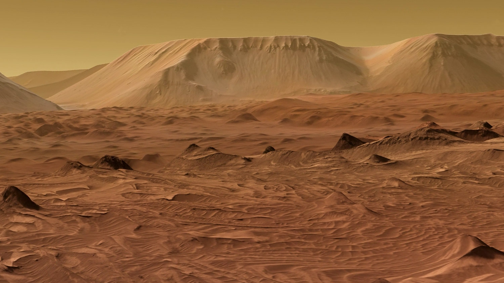
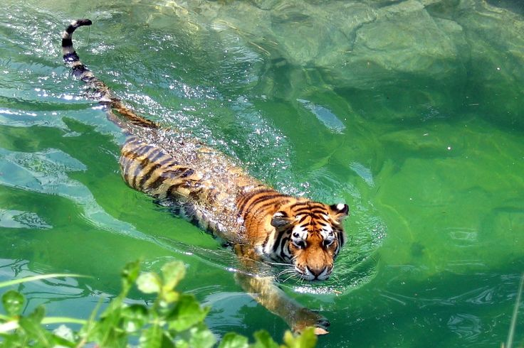
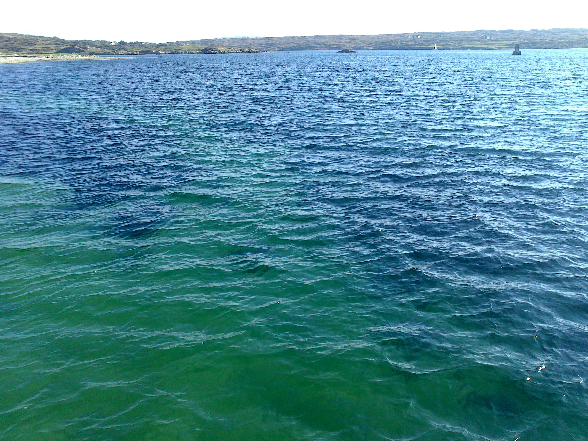

# Poisson Blending
 An Image Processing application based on the paper <http://www.irisa.fr/vista/Papers/2003_siggraph_perez.pdf>
 
 ## Variant 1
 Gradient based blending of empty marked space in an image 
 
 Original Image -
 

 ## Variant 2_A
 Seamless Cloning by importing gradients for Grayscale images
 
 Original Images -
 

  
  

## Variant 2_B
 Seamless Cloning by mixing gradients for Grayscale images
 
 Original Images -
 

  
  

## Variant 3
 Seamless Cloning by importing gradients for RGB images
 
 
 

